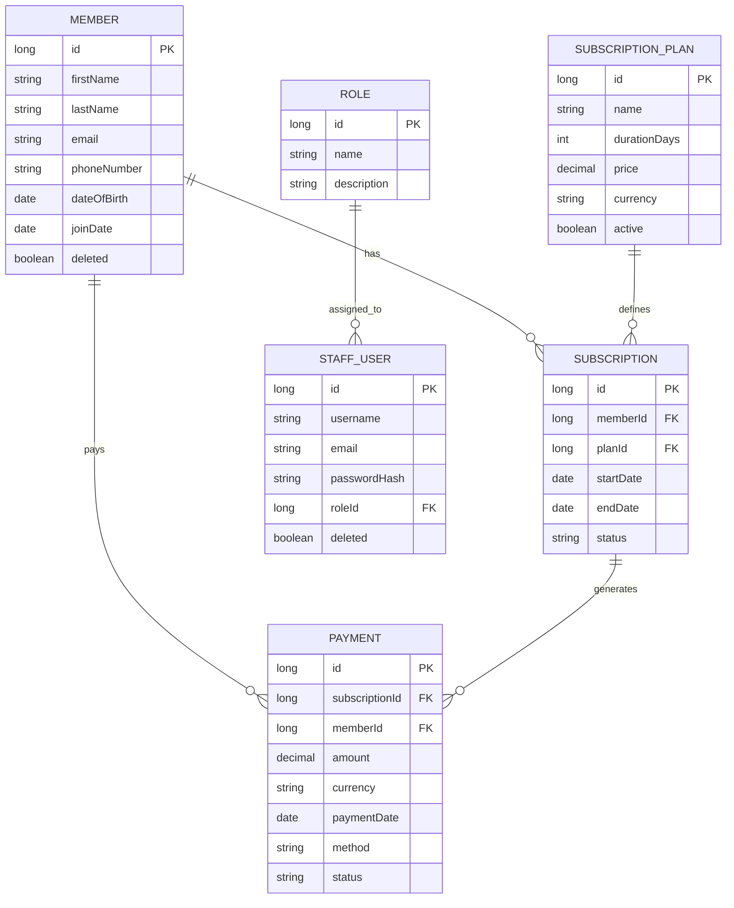

# IRON FORGE

Gym membership management platform. Final project for Coding Factory 9 (AUEB), an internal
tool for gym staff to manage members, subscriptions and payments.

Spring Boot REST API, React/TypeScript frontend, MySQL, with JWT authentication, role-based
access control (ADMIN / TRAINER), soft delete, async report generation, Flyway-versioned
schema and Swagger/OpenAPI docs.

## Live demo

- Frontend: https://ironforge-frontend-latest.onrender.com
- Backend / Swagger UI: https://ironforge-backend-latest.onrender.com/swagger-ui.html

Seeded login: `trainer1` / `Trainer1234.!`. Hosted on Render free tier + Aiven free MySQL. The
first request after a period of inactivity may take a few extra seconds to respond.

## Domain

Two bounded contexts:

- **Membership** — Member, SubscriptionPlan, Subscription, Payment
- **Identity & Access** — StaffUser, Role

Aggregates reference each other by ID rather than object composition. `Email`, `PhoneNumber`
and `Money` are value objects embedded on their owning entities. `Member` and `StaffUser` are
soft-deleted; `Subscription` and `Payment` are immutable historical records once created;
`SubscriptionPlan` is retired via an `active` flag instead of deletion, since past
subscriptions still reference it.



### Why Payment has no create endpoint of its own

A Payment is generated automatically, in the same backend transaction, whenever a
Subscription is created, it's never created directly through the API. This mirrors how a
gym membership actually works: you pay when you sign up, not through a separate step. Every
renewal is itself a new Subscription record, so the 1 Subscription equals 1 Payment
relationship stays consistent without needing a dedicated "record payment" flow. Payment is
read-only after creation, visible only through the Payment History section on Member Detail.

## Stack

Backend: Java 21, Spring Boot 3, Spring Security, Spring Data JPA, MySQL 8, Flyway, JWT,
springdoc-openapi.

Frontend: React 18, TypeScript, Vite, React Router, Axios.

## Prerequisites

- Java 21 (JDK)
- Docker + Docker Compose
- Node.js 20+ and npm (only needed for Option A below, or for building the frontend outside Docker)

## Running it locally

Two ways to run this, depending on whether you want to iterate on the backend or just see
the whole thing working.

### Option A: backend on the host, MySQL in Docker (for backend development)

```
docker compose up -d mysql
cd backend
./gradlew bootRun
```

This uses the `dev` Spring profile, which points at MySQL on `localhost:3307`. Flyway runs
the migrations on startup and seeds:

- Roles `ADMIN` and `TRAINER`
- A bootstrap login: `admin` / `admin123`
- Three subscription plans (Monthly €25, Quarterly €65, Annual €220)

API at `http://localhost:8080`, Swagger UI at `http://localhost:8080/swagger-ui.html`.

Then, for the frontend:

```
cd frontend
cp .env.example .env
npm install
npm run dev
```

Dev server at `http://localhost:5173`. Log in with the seeded admin above.

### Option B: everything in Docker (closest to how it'd actually be deployed)

```
docker compose up -d --build
```

Builds and starts MySQL, the backend (on the `docker` profile) and the frontend (served by
nginx), wired together on the compose network.

- Frontend: `http://localhost:8081`
- Backend API: `http://localhost:8080`

Tear down, including the database volume:

```
docker compose down -v
```

## Deploying to the cloud

The live demo above runs on:

- **Database**: Aiven for MySQL (free tier)
- **Backend**: Render Web Service, deployed from a prebuilt Docker image (`backend/Dockerfile`)
- **Frontend**: Render Web Service, deployed from a prebuilt Docker image (`frontend/Dockerfile`,
  nginx serving the Vite build)

Both Render services are image-backed rather than Git-backed: build and push each image to a
registry, then point Render at `docker.io/<user>/<image>:latest`. The frontend image bakes
`VITE_API_BASE_URL` in at build time (`--build-arg VITE_API_BASE_URL=<backend-url>`), so the
backend must be deployed first. `ALLOWED_ORIGINS` on the backend must then be set to the
frontend's exact Render URL for CORS to work.

## Configuration

Everything below has a working default for local use, you only need to set these if
you're deploying somewhere real.

| Variable | Used by | Default |
|---|---|---|
| `JWT_SECRET` | backend | dev-only placeholder, **must** be overridden outside local dev |
| `DB_USERNAME` / `DB_PASSWORD` | backend, mysql | `ironforge` / `ironforge123` |
| `ALLOWED_ORIGINS` | backend | `http://localhost:5173,http://localhost:3000` (CORS) |
| `VITE_API_BASE_URL` | frontend | `http://localhost:8080` (build-time only, see above) |

## Auth

```
POST /api/auth/login
{ "username": "admin", "password": "admin123" }
```

returns a JWT. Send it back as `Authorization: Bearer <token>` on everything else.

- `/api/staff/**` and writes to `/api/subscription-plans/**` require role `ADMIN`.
- Everything else under `/api/**` just requires being logged in, as either role.
- New staff accounts are always created with role `TRAINER`, there's a single Admin
  account, and it isn't reassignable through the app.

## Async reports

Revenue reports run as a background job instead of blocking the request:

```
POST /api/reports/revenue?from=2026-01-01&to=2026-01-31   → { "jobId": "..." }
GET  /api/reports/{jobId}                                  → poll until status is DONE
```

## Testing

Backend, service-layer unit tests (JUnit 5 + Mockito), no database required:

```
cd backend
./gradlew test
```

Frontend, component tests (Vitest + Testing Library, API calls mocked with MSW):

```
cd frontend
npm test
```

## Building for deployment

```
cd backend && ./gradlew bootJar     # backend/build/libs/backend-0.0.1-SNAPSHOT.jar
cd frontend && npm run build        # frontend/dist/
```

Or just build the Docker images directly, see "Deploying to the cloud" above.

## Known limitations

- **No brute-force protection on login.** `POST /api/auth/login` accepts unlimited
  attempts, no rate limiting, no lockout.
- **`Pageable` has no max page size.** `?size=999999` would try to pull an entire table
  in one page. Would need `spring.data.web.pageable.max-page-size` set.
- **`spring.jpa.open-in-view` is left at its default (`true`)**, which Spring logs a
  warning about on every startup. Fine here since nothing renders server-side views, but
  the correct setting for a pure REST API is `false`.
- **No Docker healthcheck on the `backend` service**, only `mysql` has one, so
  `depends_on: condition: service_healthy` guarantees the database is ready, not the API.
- **No server-side search or filtering on the Subscription list**, only pagination. The
  Member list does support a `search` param (matches first/last name).
- **No request timeout on the frontend's Axios client, and no top-level error boundary.**
  A hung backend request spins forever; an unexpected component error blanks the screen
  instead of showing a fallback UI.